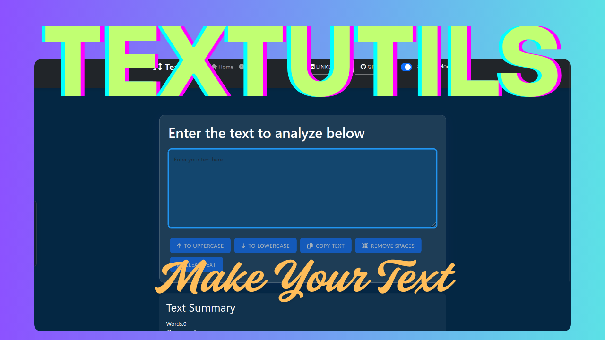

# 📝 TextUtils Application

<div align="center">

## [🔗 Live Demo](https://textutils-sainathreddy666.vercel.app/)

<!-- Optionally add a preview image here -->



</div>

## 📋 Overview

TextUtils is a modern, responsive React application that provides a suite of text manipulation utilities. Users can analyze, transform, and clean up their text with ease. The app features light and dark modes, real-time alerts, and a simple, intuitive interface.

## ✨ Features

- ✏️ Convert text to uppercase and lowercase
- 🧹 Remove extra spaces
- 🔢 Count words and characters
- 📋 Copy text to clipboard
- 🌓 Toggle between light and dark mode
- ⚡ Real-time alerts for user actions
- 📱 Fully responsive design for all devices

## 🛠️ Technologies Used

- **React** - Frontend library
- **React Router** - Routing
- **CSS** - Styling

## 🚀 Getting Started

### Prerequisites

- Node.js (v14 or higher)
- npm or yarn

### Installation

1. Clone the repository

   ```bash
   git clone <your-repo-url>
   cd textutils
   ```

2. Install dependencies

   ```bash
   npm install
   # or
   yarn
   ```

3. Start the development server

   ```bash
   npm start
   # or
   yarn start
   ```

4. Open your browser and navigate to `http://localhost:3000`

## 📝 Usage

1. Enter or paste your text in the main text area
2. Use the available buttons to transform or analyze your text
3. Switch between light and dark mode using the toggle in the navbar
4. View alerts for feedback on your actions

## 🔗 Connect with Me

[](https://www.linkedin.com/in/sainath666)

---

<div align="center">
  <p>Made with ❤️ by Sainathreddy</p>
</div>
